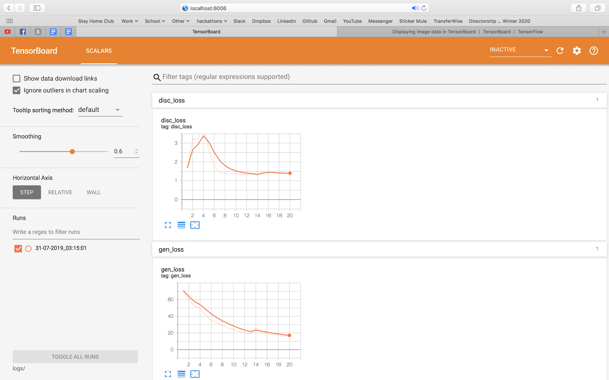

# oct-opus

Image processing for OCT retina and cornea cross-sections.

## To run training

1. Move all unrelated checkpoints out of the `./training_checkpoints` folder.

2. Open `./run.sh` with a text editor and configure the starting and ending epoch numbers.

3. Execute `./run.sh` (under the virtual env with all `pip` dependencies already installed.) The `run.sh` script will run `python run.py` with the correct parameters to run for the number of epochs specified in the script.

This is a stupid procedure, because we're actually spawning a new `run.py` program for every epoch, and then `run.py` loads a checkpoint (if the `restore` argument was supplied, that is) and then runs just one epoch of training, saves a checkpoint, and bails out. And `run.sh` is the harness that keeps spawning new `run.py` programs for each epoch. The reason we're doing this dumb thing is because of a memory leak that we don't have time to look into right now - the main thing is just to evaluate the pix2pix baseline, and the results should be the same with this approach, and the memory consumption will be under control so we can run large numbers of epochs.

The only thing we have to watch out for is SSD space (TODO: modify the code to only keep training checkpoints in a certain window and auto-delete old ones whenever we save a new one. This code might live at the bottom of `train.py` - take a look.)

## To view Tensorboard

Execute `tensorboard --logdir logs/`, then open `localhost:6006` in a web browser. You should see something like this:



You can view the Tensorboard dashboard both during or after training the model.

## To generate inferred images

To generate sets of predicted images based on B-scans within test sets, put all relevant test sets within the `/private/fydp1/testing-data` folder. Note that `utils.py` will assume 4 acquisitions (i.e. 4 B-scans) for each particular cross section, so 4:1 ratio between OMAGs:Bscans. Then, run `python run.py predict`. It will create a `predicted` folder containing subfolders for every eye in the test set and in there will be the inferred images, of the same cardinality as the number of OMAGs (so you can compare each inferred image in sequence to the OMAG to see how good of a job it did at enhancing capillaries).

## Setup Procedure (for ecelinux)

1. Go to eceubuntu4 via `ssh username@eceubuntu4.uwaterloo.ca` (may have to use `username@ecelinux4.uwaterloo.ca` as proxy).

2. `cd /private/fydp1` to access data and code.

3. Run `source ./venv/bin/activate` to initialize the Python environment.

4. Start Jupyter NoteBook: `jupyter notebook`. This will startup a Jupyter server.

   You should see something similar to the following.

   ```bash
   (venv) pl3li@eceubuntu4: /private/fydp1:$ jupyter notebook
   [I 16:24:34.605 NotebookApp] Serving notebooks from local directory: /private/fydp1
   [I 16:24:34.605 NotebookApp] The Jupyter Notebook is running at:
   [I 16:24:34.605 NotebookApp] http://localhost:8888/?token=96e57ab83cd927178dd00e463bb4af11b54053d05829041a
   [I 16:24:34.605 NotebookApp] Use Control-C to stop this server and shut down all kernels (twice to skip confirmation).
   [W 16:24:34.630 NotebookApp] No web browser found: could not locate runnable browser.
   [C 16:24:34.630 NotebookApp]

       To access the notebook, open this file in a browser:
           file:///home/pl3li/.local/share/jupyter/runtime/nbserver-28660-open.html
       Or copy and paste one of these URLs:
           http://localhost:8888/?token=96e57ab83cd927178dd00e463bb4af11b54053d05829041a
   ```

   Make note of the port number that is provided. You may be assigned a port number that is different from 8888.

5. Go to another terminal and run `ssh -NL 8000:localhost:8888 username@eceubuntu4.uwaterloo.ca` on your own machine (not ecelinux) to setup the ssh tunnel.

   You may need to replace 8888 with the port number that you received. The prompt should hang.

6. Go to `http://localhost:8000/?token=96e57ab83cd927178dd00e463bb4af11b54053d05829041a`, replacing the token in the URL with your own.

7. Use Ctrl-C to close the ssh tunnel and the Jupyter server.

## Enface Procedure (for ecelinux)

1. ssh to eceubuntu4 using the `-Y` flag

2. go to your source directory

3. `cd enface`

4. `./enface.sh`, a matlab terminal will pop up

5. enter the datestamp of the directory as per the prompt (e.g. `2015-09-07-Images-46`). The output should look something like the following.

   ```bash
   pl3li@eceubuntu4: /private/fydp1/pl3li-oct-opus/pl3li-playground:$ ./enface.sh
   MATLAB is selecting SOFTWARE OPENGL rendering.

                                                                                             < M A T L A B (R) >
                                                                                   Copyright 1984-2018 The MathWorks, Inc.
                                                                                    R2018b (9.5.0.944444) 64-bit (glnxa64)
                                                                                               August 28, 2018
   ```


    To get started, type doc.
    For product information, visit www.mathworks.com.


        Classroom License -- for classroom instructional use only.
    please provide datestamp for /private/fydp1/oct-opus-data/??? : 2015-09-07-Images-46
    Warning: Directory already exists.
    > In matlab_combine_images (line 13)
      In run (line 91)
    1280 images found
    Step 1/3 Complete
    Step 2/3 Complete
    Step 3/3 Complete
    Warning: MATLAB has disabled some advanced graphics rendering features by switching to software OpenGL. For more information, click <a href="matlab:opengl('problems')">here</a>.
    Warning: Image is too big to fit on screen; displaying at 67%
    ```

6. two images should pop up once all steps have completed, save these if you wish

7. type `rmdir(dst, 's')` if you want to remove the intermediate cross-section images

8. `exit`

## Other General Recommendations and Links

- Adding the following to your local machine's `~/.ssh/config` file will automatically do the port forwarding stuff every time you run the command `ssh workstation` (coupling together the SSHing in and also forwarding your 8888 port to the server's):

```
Host workstation
    HostName eceUbuntu4.uwaterloo.ca
    User <yourusername>
    LocalForward 8888 localhost:8888
    LocalForward 6006 localhost:6006
```

There are other things you can do, like setting up a `ProxyJump` via another campus server that happens to be accessible from outside, so that you don't have to launch a VPN or be physically present on campus to directly connect to `eceUbuntu4.uwaterloo.ca`.

- Use `gpustat` to keep an eye on GPU stats like temperature as you run training.

- Use `ls -hal` to keep an eye on groups and permissions for files in `/private/fydp1/oct-opus`, make sure group `fydp2019a` has access (Pei Lin has been using 770 perms so far with success), `chgrp` or `chmod` as necessary to ensure this.

- Once you're SSHed in and wanting to start your Jupyter Notebook server, first spin up `tmux` (`tmux new -s coolcats`). Then you can Ctrl+B, D to detach from that tmux session anytime (or lose your Internet connection and Jupyter will keep running in the background. Then `tmux attach -t coolcats` to re-attach to that tmux session. [More information here](https://towardsdatascience.com/jupyter-and-tensorboard-in-tmux-5e5d202a4fb6).
