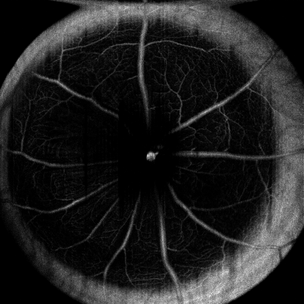

# Procedures

## Pre and Post Processing

### Flattening Script (Pre)

Cross-sections with curvature can be visually flattened to produce a consistent final en-face image
and more standard looking cross-sections. The original "as-is" MATLAB implementation is located at
`scripts/flatten_original.m`. Note that it contains hardcoded paths and is only meant to act as
a reference in the event that it is needed. This script was provided by Han Le (han.le@uwaterloo.ca).

The script has since been replaced by an equivalent Python implementation (see `scripts/flatten.py`).
The idea is to use edge detection and polynomial interpolation to fit a curve (2nd degree in this case)
to the retinal layers. Afterwards, each column is rotated according to a value determined by the
fitted polynomial. A gaussian filter blur is also applied prior to the edge detection to improve the
accuracy of the edge detection. Lastly, note that rows >= 350 are also set to 255 (i.e. white) to
avoid noise interference.

An example is shown below. The image on the left is the un-flattened original while the image on
the right is resulting flattened image.

 

### Enface Generation (Post)

An en-face image provides a two-dimensional view of the retina whose field-of-view is along the optical axis.
Each en-face is assembled from the 512 cross-sections of a retina. To avoid including noise into the images,
only cross-section layers (rows in the B-scans) from 50 to 256 (inclusive) were used. Before a scan is used,
each scan’s pixel value is inverted. In this context, a pixel value of 0 (i.e. black) represents background
or the absence of data. Two types of en-faces computed for clinical diagnostic purposes are used in this
project; max normalized (i.e. max norm) and sum. A max normalized en-face, as its name suggests, is
obtained by first normalizing each pixel and then selecting the maximum pixel value along the optic axis
for a given position in space. In contrast, a sum en-face is obtained by aggregating all pixel values along
the optical axis. Before being saved, each en-face is normalized to a value between 0 and 255 to adhere to
grayscale image standards. Examples of both types of en-faces are illustrated below to showcase the concept.

 

The image on the left is the `multi_slice_max_norm.png` while the image on the right is the `multi_slice_sum.png`.

To generate an en-face for a single dataset, use a command similar to:
`python enface.py single ../oct-opus-data/sample_datasets/2015-10-27___512_2048_Horizontal_Images6/OMAG\ Bscans/`

To generate en-faces for multiple datasets together, use a command similar to:
`python enface.py multi ../oct-opus-data/sample_datasets/`

The en-faces are stored in the same directory as the images used to create them.

In addition, the original MATLAB en-face script provided by Zohreh Hosseinaee (z5hosseinaee@uwaterloo.ca)
is located at `scripts/enface_original.m` for reference purposes only.

### Histogram Equalization (Post)

[Histogram equalization](https://en.wikipedia.org/wiki/Histogram_equalization) is a technique
used in image processing to normalize the pixel values of an image
by balancing the frequency of each pixel intensity (i.e. flattening
the histogram). It is particularly useful as a "post-processing"
step to run after generating predicted OCTA-like datasets using
our software.

The Python code for histogram equalization
is quite simple (with the use of a few dependencies
you can install with `pip install -r requirements.txt` using our provided requirements file in this repository).
The `scripts/post-normalizer.py` script is
a Python CLI with only one command-line argument: the path to an `experiment-...`
folder (or any other folder containing
subfolders which each contain a sequence
of numbered cross-sections) as would be
produced by using our software to generate
predictions for a test set.

It then performs histogram normalization of
every single image in-place (i.e. saving
the result and overwriting the previous
non-normalized image).

Alternatively, to only normalize en-face
(C-scan) images, there is an optional
`-n` command line flag that can be passed
to the enface generation script (`enface.py`)
described in the previous section. This will
leave the cross-sections untouched, but when
generating enfaces for each sequence of
cross-sections, it will perform a histogram
equalization step for the saved en-faces.

Remember that the en-face tool works for
both the `experiment-...` folder structure
(that is, for predicted images using the
trained pix2pix model) as well as raw
data folders (e.g. `all_data_original.tar.gz`).
See the "Data Set Conventions" section for
more information about these folder structures.

## Data Set Conventions

TODO

## Assumptions

TODO

